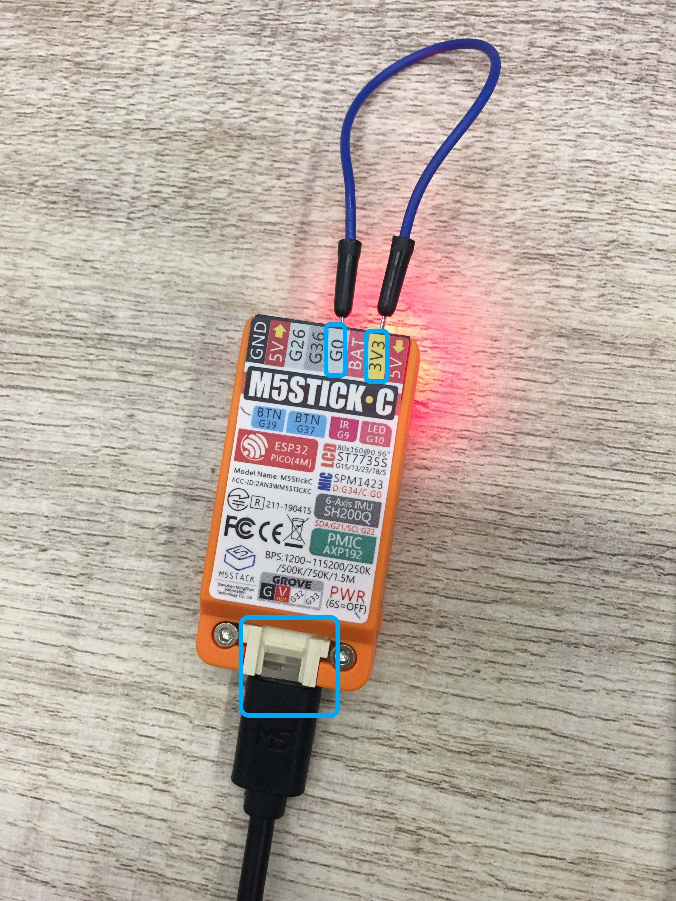

### M5StickC

Bienvenido al Internet de las Cosas.

Para comenzar a utilizar tu M5StickC y encontrar toda la información técnica, te recomendamos consultar siguiente información:

* Encender por primera vez. Al llegar de fábrica la batería estará descargada y por cuestiones de diseño, el m5stickc no arrancará hasta que sigas el siguiente procedimiento: 
1. Conectes  G0 to 3V3. 
2. Conectes el cable usb. 
3. dejes cargando el dispositivo al menos 2 horas. Después de esto, desconecta G0 a 3.3V y podrás programar normalmente con la IDE de Arduino.

* TL;DR  Arduino IDE
1. Agrega el dispositivo con Board Manager (es el mismo que ESP32):
     https://dl.espressif.com/dl/package_esp32_index.json
2. Instala la librería desde Manage Libraries. El nombre de la librería es: 
        M5StickC
3. Selecciona la tarjeta M5StickC y el baudrate 115200.
4. Programa el ejemplo que encontrarás en el IDE de Arduino examples-M5StickC-basics-factory test  
---PROTIP: Para cargar el sketch deja desconectado cualquier cable de los GPIOs y presiona el botón de power mientras se está subiendo el sketch.

* Facebook.
[Grupo de Facebook en español sobre Internet de las Cosas](https://www.facebook.com/groups/724628401049648/)

* Documentación oficial del fabricante.
[M5Stack Docs | M5StickC](https://docs.m5stack.com/#/en/core/m5stickc)

* Programación con Arduino IDE
[M5StickC Quick Start - Arduino Win](https://docs.m5stack.com/#/en/quick_start/m5stickc/m5stickc_quick_start_with_arduino_Windows?id=_2-install-esp32-boards-manager)

* Videos
[Tutorial para programar con Arduino IDE](https://www.youtube.com/watch?v=ppXkl0046dc)

* Foro oficial del fabricante.
[Foro oficial de M5Stack, fabricante de M5StickC](http://community.m5stack.com/)

* Información general del ESP32
[ESP32 docs en Cosismo](https://cosismo.github.io/esp32-devkit/)

¡Suerte!  
  Equipo Cosismo
